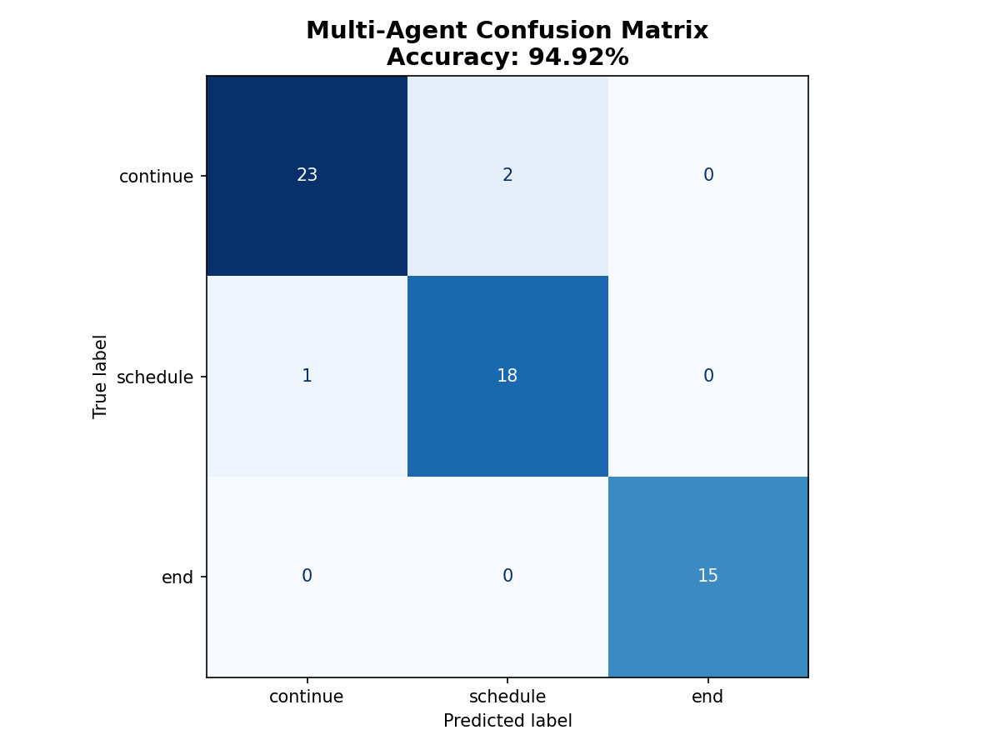

<!-- PROJECT LOGO -->
<p align="center">
  
</p>

<h1 align="center">GenAI SMS Recruitment Bot</h1>

<p align="center">
  An SMS-based multi-agent chatbot that interviews candidates for a Python Developer position<br>
  <a href="https://github.com/emeelashkar-star/genai-recruitment-bot">View Project</a>
  ·
  <a href="https://github.com/emeelashkar-star/genai-recruitment-bot/issues">Report Bug</a>
  ·
  <a href="https://github.com/emeelashkar-star/genai-recruitment-bot/issues">Request Feature</a>
</p>

---

## Table of Contents
- [About The Project](#about-the-project)
- [Features](#features)
- [Architecture](#architecture)
- [Getting Started](#getting-started)
- [Usage](#usage)
- [Example Conversation](#example-conversation)
- [Screenshots](#screenshots)
- [Project Structure](#project-structure)
- [Evaluation Results](#evaluation-results)
- [To-Do List](#to-do-list)
- [License](#license)
- [Contact](#contact)
- [Acknowledgments](#acknowledgments)

---

## About The Project

> A multi-agent GenAI chatbot that interacts with job candidates via SMS (simulated via Streamlit).
> It gathers information, answers candidate questions, and schedules interviews autonomously.

<div style="background: #272822; color: #f8f8f2; padding: 10px; border-radius: 8px;">
  <b>Technologies:</b> Python, OpenAI API, LangChain, ChromaDB, SQLite, Streamlit
</div>

---

## Features

- [x] Multi-agent orchestration (Main Agent + 3 Advisors)
- [x] Vector search via ChromaDB (job description embeddings)
- [x] SQL-based interview scheduling
- [x] Fine-tuned Exit Advisor model
- [x] Streamlit UI (SMS simulation)
- [x] LangChain Agents & Memory
- [x] Environment variable management (.env)
- [x] Modern Python project structure
- [ ] Cloud deployment _(coming soon!)_

---

## Architecture

| Agent | Role |
|---|---|
| **Main Agent** | Orchestrates the dialogue, decides: Continue / Schedule / End |
| **Exit Advisor** | Fine-tuned model that detects when to end the conversation |
| **Scheduling Advisor** | Queries SQL DB for available slots, proposes interview times |
| **Info Advisor** | Retrieves relevant info from ChromaDB (job description embeddings) |

---

## Getting Started

### Prerequisites
- Python >= 3.8
- pip
- OpenAI API key
- VS Code (recommended)

### Installation
```bash
git clone https://github.com/emeelashkar-star/genai-recruitment-bot.git
cd genai-recruitment-bot
python -m venv .venv
# Windows
.venv\Scripts\activate
# macOS / Linux
source .venv/bin/activate
pip install -r requirements.txt
```

### Environment Variables

Create a `.env` file in the root directory:
```env
OPENAI_API_KEY=your_openai_api_key_here
```

### Run Embedding (one-time setup)
```bash
python -m app.modules.embedding
```

### Run the App
```bash
python -m streamlit run streamlit_app/streamlit_main.py
```

---

## Usage

The Streamlit app simulates an SMS conversation. The candidate types messages and the multi-agent system responds, routing through the appropriate advisor at each step.

---

## Example Conversation

**Bot:** Hi! Thanks for applying to our Python Developer position.
Could you tell me a bit about your Python experience?

**Candidate:** I have 4 years of experience with Python, mostly backend development with Flask and FastAPI.

**Bot:** That sounds great! We are looking for someone with strong Python skills including
frameworks like NumPy, Pandas and PyTorch. Based on your background, you seem like a strong fit!
Would you like to schedule an interview with our recruiter?

**Candidate:** Yes, I'd love to!

**Bot:** Here are the 3 nearest available slots:
- Date: 2026-03-23, Time: 09:00
- Date: 2026-03-23, Time: 10:00
- Date: 2026-03-23, Time: 11:00

Please let me know which time works best for you!

---

## Screenshots

<p align="center">
  
</p>

---

## Project Structure
```text
genai-recruitment-bot/
├── .env                          # Environment variables (ignored by git)
├── .gitignore
├── requirements.txt
├── README.md
├── app/
│   ├── __init__.py
│   ├── main.py
│   └── modules/
│       ├── __init__.py
│       ├── main_agent.py         # Main orchestration agent
│       ├── exit_advisor.py       # Fine-tuned exit detection
│       ├── scheduling_advisor.py # SQL + scheduling
│       ├── info_advisor.py       # ChromaDB vector retrieval
│       ├── embedding.py          # Offline embedding step
│       └── fine_tuning_prep.py   # Fine-tuning data preparation
├── streamlit_app/
│   ├── __init__.py
│   └── streamlit_main.py         # Main Streamlit app
├── data/
│   ├── sms_conversations.json    # Labeled training data
│   ├── db_Tech.sql               # Recruiter availability DB
│   └── Python Developer Job Description.pdf
└── tests/
    ├── test_evals.ipynb          # Evaluation notebook
    └── confusion_matrix.png      # Results visualization
```

---

## Evaluation Results

The system was evaluated on 59 labeled test cases from real SMS conversations:

| Metric | Score |
|---|---|
| **Overall Accuracy** | **94.92%** |
| End detection | 100% (15/15) |
| Schedule detection | 94.7% (18/19) |
| Continue detection | 92% (23/25) |

---

## To-Do List

- [x] Project setup & structure
- [x] Embedding pipeline (ChromaDB)
- [x] Main Agent implementation
- [x] Exit Advisor (fine-tuned)
- [x] Scheduling Advisor (SQL)
- [x] Info Advisor (vector retrieval)
- [x] Streamlit UI
- [x] Evaluation notebook
- [ ] Cloud deployment

---

## License

Distributed under the MIT License. See `LICENSE` for more information.

---

## Contact

**Emeel Ashkar** - emeel.ashkar@gmail.com
Project Link: [https://github.com/emeelashkar-star/genai-recruitment-bot](https://github.com/emeelashkar-star/genai-recruitment-bot)

---

## Acknowledgments

- [OpenAI API](https://platform.openai.com/docs/overview)
- [LangChain](https://www.langchain.com/)
- [ChromaDB](https://www.trychroma.com/)
- [Streamlit](https://streamlit.io/)
- [SQLAlchemy](https://www.sqlalchemy.org/)
